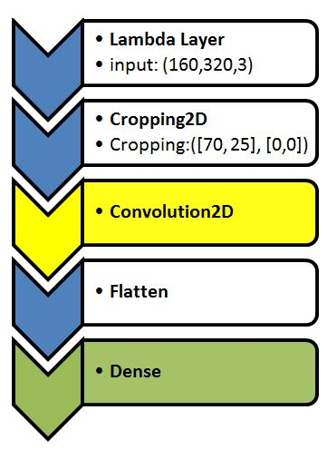
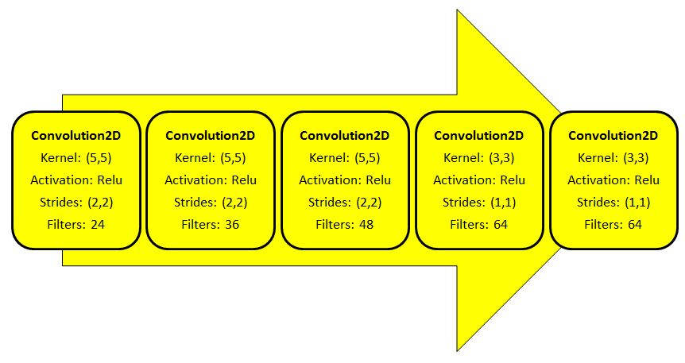
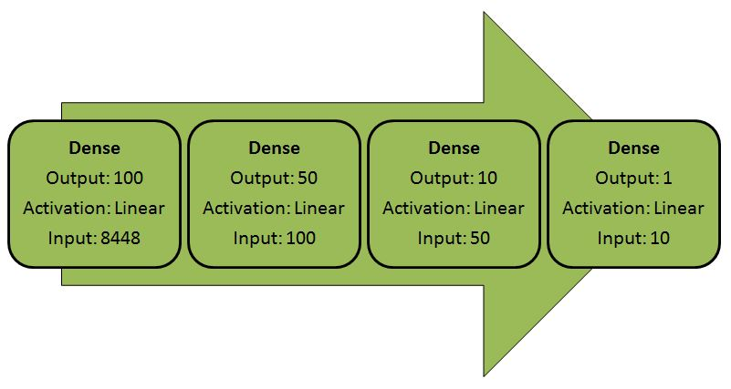
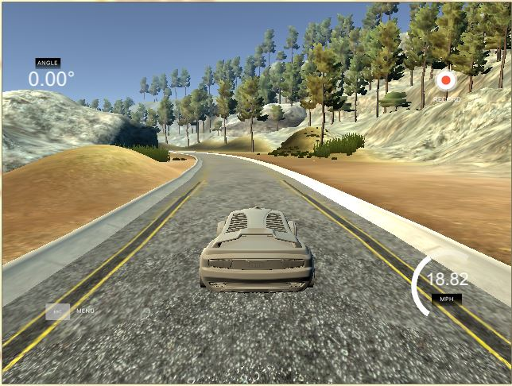
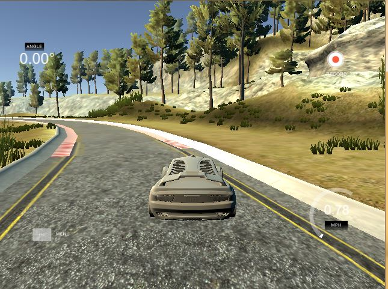
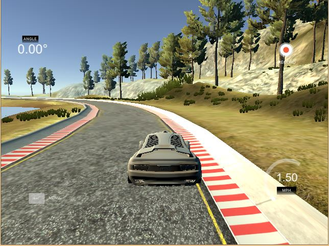
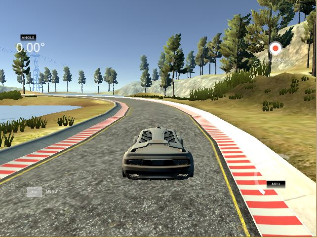

# **Behavioral Cloning** 

## Writeup Template

### You can use this file as a template for your writeup if you want to submit it as a markdown file, but feel free to use some other method and submit a pdf if you prefer.

---

**Behavioral Cloning Project**

The goals / steps of this project are the following:
* Use the simulator to collect data of good driving behavior
* Build, a convolution neural network in Keras that predicts steering angles from images
* Train and validate the model with a training and validation set
* Test that the model successfully drives around track one without leaving the road
* Summarize the results with a written report


[//]: # (Image References)

[image1]: ./examples/placeholder.png "Model Visualization"
[image2]: ./examples/placeholder.png "Grayscaling"
[image3]: ./examples/placeholder_small.png "Recovery Image"
[image4]: ./examples/placeholder_small.png "Recovery Image"
[image5]: ./examples/placeholder_small.png "Recovery Image"
[image6]: ./examples/placeholder_small.png "Normal Image"
[image7]: ./examples/placeholder_small.png "Flipped Image"

## Rubric Points
### Here I will consider the [rubric points](https://review.udacity.com/#!/rubrics/432/view) individually and describe how I addressed each point in my implementation.  

---
### Files Submitted & Code Quality

#### 1. Submission includes all required files and can be used to run the simulator in autonomous mode

My project includes the following files:
* model.py containing the script to create and train the model
* drive.py for driving the car in autonomous mode
* model.h5 containing a trained convolution neural network 
* writeup_report.md or writeup_report.pdf summarizing the results

#### 2. Submission includes functional code
Using the Udacity provided simulator and my drive.py file, the car can be driven autonomously around the track by executing 
```sh
python drive.py model.h5
```

#### 3. Submission code is usable and readable

The model.py file contains the code for training and saving the convolution neural network. The file shows the pipeline I used for training and validating the model, and it contains comments to explain how the code works.

### Model Architecture and Training Strategy

#### 1. An appropriate model architecture has been employed

I first started testing my model by using the LeNet Architecture and got fairly decent results on the driving. Then I switched over to NVIDIA's Autonomous Car Group's Model and got much better results and stuck with that. I kept using 5 epochs and that seemed to work pretty well in terms on loss and validation loss. 

#### 2. Attempts to reduce overfitting in the model

Instead of using overfitting techniques like dropout or max pooling, I decided to just stay with NVIDIA's model because I got the results that I needed when training with low epochs. Using validation data by splitting up the training data helped as well. 

#### 3. Model parameter tuning

The model used an adam optimizer, so the learning rate was not tuned manually (model.py line 125).

#### 4. Appropriate training data

Training data was chosen to keep the vehicle driving on the road. I used a combination of center lane driving, recovering from the left and right sides of the road. This data could have been manually recorded by driving in Training Mode on the simulator or the user could have used Udacity's large set of prerecorded training data. I chose to use the latter and it worked well. 

For details about how I created the training data, see the next section. 

### Model Architecture and Training Strategy

#### 1. Solution Design Approach

My first step was to use a convolution neural network model similar to the LeNet architecture with 5 epochs. I thought that this architecture might be a good starting point just to see if I was able to successfully create a working model with the recorded data and see if it resulted in a better output in Autonomous mode on the simulator. I did get some okay results but overall the car seemed to crash or drive into the lake. 

My second step was to use NVIDIA's Autonomous Car Group's Model architecture that they actually use on real cars and this seemed to work wonders. I got a much better result in driving in autonomous mode on the simulator using only 5 epochs. The next steps were just fine tuning. 

I made sure to add preprocessing layers which consisted of normalization and cropping of the image data. I also added augmented data by using flipped images with negative angles to increase the amount of data used for learning. This seemed to solve most problems and the car was driving pretty well. 

In order to gauge how well the model was working, I split my image and steering angle data into a training and validation set. 

At the end of the process, the vehicle is able to drive autonomously around the track without leaving the road.

#### 2. Final Model Architecture

Here is a visualization of the architecture 





#### 3. Creation of the Training Set & Training Process

Besides using Udacity's prerecorded data set, I experimented with collecting my own data sets as well.

To capture good driving behavior, I first recorded two laps on track one using center lane driving. Here is an example image of center lane driving:



I then recorded the vehicle recovering from the left side and right sides of the road back to center so that the vehicle would learn to recover on its own when veering off. These images show what a recovery looks like starting from the center, veering off to the right and recovering back to the center:






To augment the data set, I also flipped images and angles thinking that this would would help the training data and the learning process. 

After the collection process, I had several number of data points. I then preprocessed this data by normalizing and cropping out unnecessary part of the image, using only the road to let the model learn.


I finally randomly shuffled the data set and put 20% of the data into a validation set. 

I used this training data for training the model. The validation set helped determine if the model was over or under fitting. The ideal number of epochs was 5 after many different experiments. I used an adam optimizer so that manually training the learning rate wasn't necessary.
